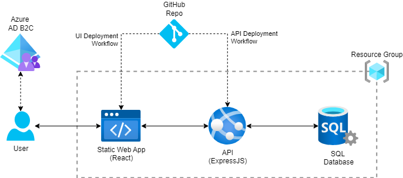
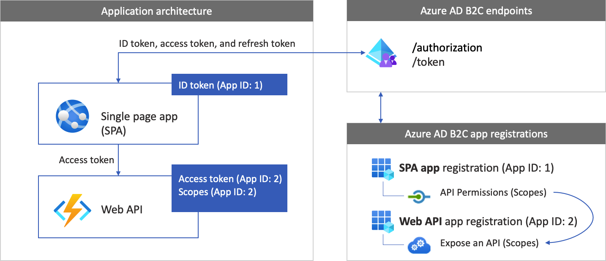

## Application Overview

The purpose of this sample application is to demonstrate the usage of Azure Active Directory B2C (Azure AD B2C) for authentication and authorization in a full-stack web application with a React frontend (deployed as Azure Static Web App), a backend API written in Express (deployed as an Azure App Service) that connects to a SQL database. The CI/CD pipelines are set up using GitHub Actions to automate the build and deployment processes.

### Application Architecture Diagram

Here is the application architecture diagram:



This diagram shows the components involved in the application:
1. **Azure Static Web Apps**: Hosts the React frontend application and provides a URL for accessing the application.
2. **Azure Web Apps**: Hosts the Express backend API and provides a URL for accessing the API.
3. **Azure SQL Database**: Stores the data for the application, which is accessed by the backend API.
4. **Azure AD B2C**: Handles the authentication and authorization for the application, allowing users to sign in and access the application.
5. **GitHub Actions**: Provides CI/CD pipelines for automating the build and deployment processes.

The app architecture with regards to app registrations is illustrated in the following diagram (source: [Microsoft Docs](https://docs.microsoft.com/en-us/azure/active-directory-b2c/configure-authentication-sample-spa-app)):



### Prerequisites

1. **Azure Subscription**:
    - An active Azure subscription is required to deploy the application to Azure services such as Azure Static Web Apps and Azure Web Apps.

2. **Azure AD B2C Tenant**:
    - An Azure AD B2C tenant is required for handling authentication and authorization.
    - App registrations for the frontend and backend need to be created in the Azure AD B2C tenant.
    - Policies for sign-in and sign-up should be configured in the Azure AD B2C tenant.For this application, a user flow named `B2C_1_Sign_Up_Sign_In` has been used.

3. **Node.js and npm**:
    - Node.js and npm (Node Package Manager) should be installed on your local development machine.
    - These are required to run and build the React frontend and Express backend.

4. **Azure CLI** (optional):
    - Azure CLI should be installed and configured on your local machine.
    - This is used for deploying the application to Azure and managing Azure resources.

5. **GitHub Account**:
    - A GitHub account is required to use GitHub Actions for CI/CD.
    - The repository should be hosted on GitHub to leverage GitHub Actions workflows.

6. **Visual Studio Code**:
    - Visual Studio Code (VS Code) is recommended for editing and managing the project files.
    - Extensions for Azure and GitHub integration can be helpful.

5. **GitHub Account**:
    - Create a GitHub account if you don't have one.
    - Clone the repository to your local machine using `git clone https://github.com/naveedkharadi/swa-nodejs-sql.git`.

6. **Visual Studio Code**:
    - Install Visual Studio Code.
    - Recommended extensions:
        - Azure Account
        - Azure App Service
        - Azure Static Web Apps

7. **Azure SQL Database**:
    - An Azure SQL Database is required to store the data for the application. For the purpose of this demo, the free tier of Azure SQL Database can be used.
    - The database schema and initial data can be set up using the SQL scripts provided in the `1-database` directory.

### Folder Structure

- **.github/workflows/**: Contains GitHub Actions workflows for CI/CD.
    - `azure-static-web-apps-delightful-pebble-0bec84b00.yml`: Workflow for deploying the React frontend to Azure Static Web Apps.
    - `main_swa-api-sql-api.yml`: Workflow for deploying the Express backend to Azure Web Apps.

- **src/**: Contains the source code for the application.
    - **1-database/**: Contains SQL scripts for setting up the database.
        - `setup.sql`: SQL script for setting up the database schema and initial data.
    - **2-api/**: Contains the Express backend code.
        - `api.js`: Main Express application file.
        - `package.json`: Node.js dependencies and scripts for the backend.
    - **3-swa/**: Contains the React frontend code.
        - `build/`: Directory containing the built React application.
        - `public/`: Public assets for the React application.
        - `src`: Source code for the React application.
        - `package.json`: Node.js dependencies and scripts for the frontend.        

### Key Components

#### Backend (Express)

- **Environment Variables**: For local development and testing, the backend uses environment variables defined in `.env` for database connection and authentication configuration. In production, these environment variables are set in the Azure portal or using the Azure CLI.
- **Database Connection**: The backend connects to a SQL database using the `mssql` package.
- **Authentication**: The backend uses JWT for authentication, with keys fetched from Azure AD B2C.
- **API Endpoints**:
    - `GET /employees`: Fetches a list of employees from the database.
    - `GET /employees/id`: Fetches a single employee by ID from the database.
    - `POST /employees`: Adds a new employee to the database.

#### Frontend (React)

- **Environment Variables**: For local development and testing, the frontend uses environment variables defined in `.env` for MSAL (Microsoft Authentication Library) configuration and API root URL. In production, these environment variables are set in the GitHub Actions workflow.
- **MSAL Configuration**: The frontend is configured to use MSAL for authentication with Azure AD B2C.
- **Build Process**: The React application is built using `npm run build`, which outputs the built files to the `build/` directory.

### CI/CD Workflows

#### Azure Static Web Apps (Frontend)

- **Workflow File**: `azure-static-web-apps-delightful-pebble-0bec84b00.yml`

- **Workflow Steps Explained**:
    - Checkout the repository.
    - Setup Node.js.
    - Install npm packages and build the React application.
    - Deploy the built application to Azure Static Web Apps using the `Azure/static-web-apps-deploy@v1` action.

#### Azure Web Apps (Backend)

- **Workflow File**: `main_swa-api-sql-api.yml`

- **Workflow Steps Explained**:
    - Checkout the repository.
    - Setup Node.js.
    - Install npm packages and build the Express application.
    - Zip the built application.
    - Upload the artifact for deployment.
    - Deploy the application to Azure Web Apps using the `azure/webapps-deploy@v3` action.

### Authentication Mechanisms

#### React Frontend

The React frontend uses **Microsoft Authentication Library (MSAL)** for authentication with **Azure AD B2C**. Here are the key components involved:

1. **MSAL Configuration**:
    - The configuration for MSAL is defined in `src/config.js`:
    ```js
    export const msalConfig = {  
        auth: {  
            clientId: process.env.REACT_APP_CLIENT_ID, // Client ID of the app registration for UI app
            authority: process.env.REACT_APP_AUTHORITY, // <tenant-name>.b2clogin.com/<tenant-name>.onmicrosoft.com/<policy-name>
            redirectUri: process.env.REACT_APP_REDIRECT_URI, // Redirect URI for the app
            knownAuthorities: [process.env.REACT_APP_KNOWN_AUTHORITIES], // <tenant-name>.b2clogin.com
            postLogoutRedirectUri: process.env.REACT_APP_POST_LOGOUT_REDIRECT_URI, // Post-logout redirect URI
        },  
    };  
    
    export const appConfig = {  
        apiRootUrl: process.env.REACT_APP_API_ROOT_URL, // E.g. https://<api-app-name>.azurewebsites.net
        loginRequest: {  
            scopes: process.env.REACT_APP_SCOPES.split(' '), // E.g. ['openid', 'offline_access', 'https://<tenant-name>.onmicrosoft.com/swa-api-sql-api/Employees.Read', 'https://<tenant-name>.onmicrosoft.com/swa-api-sql-api/Employees.Write'] 
        },  
    };
    ```
    - This configuration uses environment variables to set up the client ID, authority, redirect URI, known authorities, and post-logout redirect URI.
   
2. **Environment Variables**:
    - For local development and testing, the environment variables are defined in the `.env` file:
    ```env
    REACT_APP_CLIENT_ID=<your-client-id>
    REACT_APP_AUTHORITY=https://<your-tenant-name>.b2clogin.com/<your-tenant-name>.onmicrosoft.com/<your-sign-in-sign-up-policy>
    REACT_APP_REDIRECT_URI=<your-frontend-app-url>
    REACT_APP_KNOWN_AUTHORITIES=<your-tenant-name>.b2clogin.com
    REACT_APP_POST_LOGOUT_REDIRECT_URI=<your-frontend-app-logout-url>
    REACT_APP_API_ROOT_URL=<your-backend-app-url>
    REACT_APP_SCOPES=<your-scopes>
    ```
    *NOTE*: When you deploy the application, since a React app does not have access a NodeJS type environment, you will need to provide these environment variables in the build pipeline using GitHub variables as you can see in the workflow file (`azure-static-web-apps-delightful-pebble-0bec84b00.yml`).

3. **Usage in Components**:
    - The MSAL configuration is used in the React components to handle authentication flows, such as login, logout, and token acquisition.

#### Express Backend

The Express backend uses **JWT (JSON Web Tokens)** for authentication, with keys fetched from **Azure AD B2C**. Here are the key components involved:

1. **JWT Middleware**:
    - The backend uses the `express-jwt` and `jwks-rsa` packages to validate JWT tokens. Since AD B2C uses key rotation, the keys are fetched dynamically from the JWKS endpoint.
    - The middleware is configured in `api.js`:
        ```js
        const authenticateToken = jwt({
        secret: jwksRsa.expressJwtSecret({
            cache: true,
            rateLimit: true,
            jwksUri: `https://${config.b2cTenant}.b2clogin.com/${config.b2cTenant}.onmicrosoft.com/${config.b2cPolicy}/discovery/v2.0/keys`
        }),
        audience: `${config.audience}`,
        issuer: `https://${config.b2cTenant}.b2clogin.com/${config.tenantId}/v2.0/`,
        algorithms: ['RS256']
        });     
        ```
    - `audience` is the client ID of the API application (which can be obtained from the app registration).
    - `issuer` is the issuer URL for the B2C tenant.
    - `jwkUri` is the URL for the JWKS endpoint to fetch the keys. This can be obtained from the B2C metadata endpoint which is available at `https://<tenant-name>.b2clogin.com/<tenant-name>.onmicrosoft.com/<policy-name>/v2.0/.well-known/openid-configuration`.

2. **Environment Variables**:
   - The environment variables are defined in the `.env` file (example below):
        ```env
        AUTHORITY=<your-tenant-name>.b2clogin.com/<your-tenant-name>.onmicrosoft.com/<your-sign-in-sign-up-policy>
        CLIENT_ID=<your-client-id>
        ```
    *NOTE*: When you deploy the application to an Azure App Service, you need to set these environment variables in the Azure portal or using the Azure CLI.

3. **Protected Routes**:
   - The `authenticateToken` middleware is used to protect routes, ensuring that only authenticated users can access them.

### Application Execution Setup

1. **Install Dependencies**:
    - Navigate to the frontend directory (3-swa) and run `npm install`.
    - Navigate to the backend directory (2-api) and run `npm install`.

2. **Environment Variables**:
    - Create a `.env` file in both the frontend and backend directories.
    - Add the necessary environment variables as specified in the `README.md`.

4. **Build and Run the Application Locally**:
    - Build the React frontend using `npm run build` in the `3-swa` directory.
    - Run the Express backend using `npm start` in the `2-api` directory.

5. **Deploy to Azure**:
    - Use the Azure CLI to deploy the frontend to Azure Static Web Apps. For example:
        ```bash
        az staticwebapp create --name <app-name> --resource-group <resource-group-name> --location <location> --sku Free --app-location <frontend-directory>
        ```
    - Use the Azure CLI to deploy the backend to Azure Web Apps. For example:
        ```bash
        az webapp up --name <app-name> --resource-group <resource-group-name> --location <location> --sku F1 --runtime "NODE|14-lts"
        ```

6. **Set Up CI/CD**:
    - Configure GitHub Actions workflows for CI/CD.
    - Create secrets & variables in the GitHub repository settings.
    - Update the workflow files with the necessary environment variables.

7. **Test the Application**:
    - Test the application by accessing the deployed frontend URL.
    - Verify that the authentication and data retrieval functionalities are working as expected.

### Additional Resources

- [Azure Static Web Apps Documentation](https://docs.microsoft.com/en-us/azure/static-web-apps/)
- [Azure Web Apps Documentation](https://docs.microsoft.com/en-us/azure/app-service/)
- [Azure AD B2C Documentation](https://docs.microsoft.com/en-us/azure/active-directory-b2c/)
- [MSAL for JavaScript Documentation](https://learn.microsoft.com/en-us/javascript/api/overview/msal-overview?view=msal-js-latest)
- [Configure a sample SPA app](https://learn.microsoft.com/en-us/azure/active-directory-b2c/configure-authentication-sample-spa-app)

